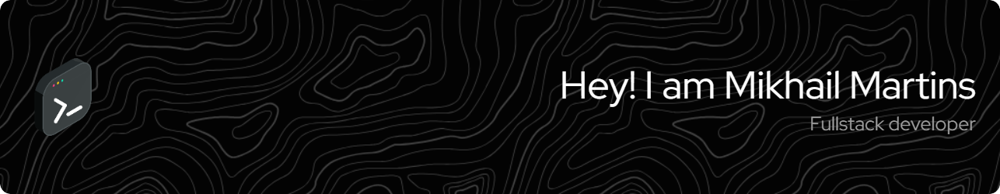

# Hello, I'm Mikhail!

I'm a computer science Student, currently learning about Full stack development and Cybersecurity.

## Here are some projects I have worked on:

 &emsp; 

 &emsp; 

# 💻 Tech Stack:

	
	
	
	
	
	
	
	
	
	
	
	
	
	
	
	
	
	
	
	
	
	
	

# 📊 GitHub Stats:

 

---

<!-- Proudly created with GPRM ( https://gprm.itsvg.in ) -->
